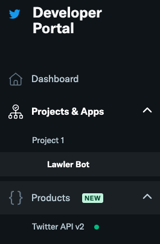

# Project 4 Pitch

## Lawlers Law Twitter Bot Announcer

Lawlers Law is a theory coined by Los Angeles Clippers broadcaster Ralph Lawler, assuming that the first team to 100 points wins the game.

I would like to make a Twitter bot that pulls live scores from current NBA games, watching for a "Lawlers Law" event, and announce them as they happen.

# Bot Location:
- twitter.com/lawler_announcer

# Project Goals:
- Learn to interact with the twitter API
- Learn how to scrape data
- Visualize occurences of Lawlers Law at-a-glance
 
# This app is for:
- Fans of the NBA and/or sport statistics

# Technology used:
- python
- beautifulsoup python package for scraping
- selenium python package for scraping dynamic content
- heavy reliance on postman for testing twitter endpoints`

# MVP
- broadcast tweets from bot account @Lawlers_laws
- retrieve live NBA scores
- announce when a live game is approaching a lawlers law scenario

# Stretch goals
- follow up on games where the lawlers law event happened, determining if the law was accurate
- track/log occurrances of each laws winners/losers
- companion webpage to view further details on occurrances

# Schedule
- tues : fumble through twitter api with postman, hopefully gain ability to post from bot account via python app - possible start on scraping data - tutorials on beautifulsoup and selenium
- wed : continue learning about data scraping
- thurs : organize twitter bot, conditions for bot to make postings
- fri : iron out bugs - begin work on companion page
- sat: companion page

# twitter dev account
