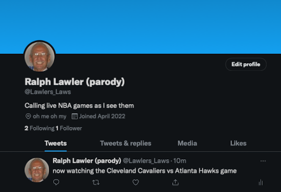

# Project 4 Pitch

# Lawlers Law Twitter Bot Announcer

What is Lawlers Law anyway?  Lawlers law is a term coined by Los Angeles Clippers broadcaster Ralph Lawler, positing that the first team to 100 points wins the game.

Inside this repo lives a bot that will announce occurences of Lawlers Law!

# Bot Location:
- twitter.com/lawler_announcer

# Project Goals:
- Learn to interact with the twitter API
- Learn how to scrape data
- Visualize occurences of Lawlers Law at-a-glance
 
# This app is for:
- Fans of the NBA and/or sport statistics

# Technology used:
- python
- twitter

# Features:
- broadcast tweets from bot account @Lawlers_laws
- retrieve live NBA scores
- announce when the bot is "watching" a game
- announce when a team has reached a "lawlers law" scenario

# Future Features:
- follow up on games where the lawlers law event happened, determining if the law was accurate
- track/log occurrances of each laws winners/losers
- companion webpage to view further details on occurrances
- refactor code to be more object oriented
- tweets incorporate common famous lawler phrases

# App in action:
